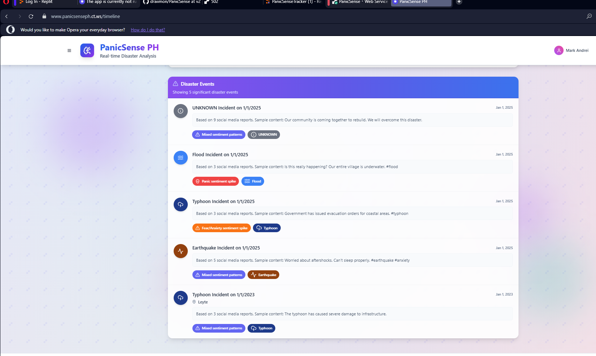

# PanicSense: Disaster Monitoring & Analysis Platform



## Overview

PanicSense is an advanced AI-powered disaster monitoring platform designed specifically for the Philippines. Built with cutting-edge technology, PanicSense analyzes real-time data from social media, news sources, and emergency reports to provide critical insights during natural calamities. The platform empowers emergency responders, government agencies, and communities with actionable intelligence to enhance disaster response and improve community resilience.

Developed by **Mark Andrei R. Castillo** © 2025

## Features

- **Real-time Sentiment Analysis**: Analyze public sentiment from various data sources during disasters
- **Geospatial Visualization**: View sentiment data on interactive maps showing affected regions
- **Disaster Event Tracking**: Monitor and track different types of disasters (floods, typhoons, etc.)
- **Performance Metrics**: Evaluate the accuracy of sentiment analysis through comprehensive metrics
- **Multi-language Support**: Process content in different languages, with a focus on Filipino dialects
- **User Authentication**: Secure login system for authorized access to the platform

## Technology Stack 2025

### Frontend Architecture
- **React 18+**: Latest UI library with advanced concurrent rendering
- **TypeScript 5.0+**: Enhanced type-safety with modern JavaScript features
- **Tailwind CSS 3.3+**: Next-gen utility-first CSS framework with JIT compiler
- **Shadcn UI**: Enterprise-grade component library built on Radix UI primitives
- **Framer Motion**: High-performance animation library for fluid UX
- **TanStack React Query v5**: State-of-the-art data fetching and caching
- **React Router v6**: Declarative routing with latest optimizations
- **Chart.js & Recharts**: Production-ready data visualization libraries
- **MapLibre GL**: High-performance interactive mapping engine

### Backend Infrastructure
- **Node.js 20+**: Latest LTS with improved performance and ECMAScript modules
- **Express.js**: Enterprise-grade API framework with TypeScript integration
- **Python 3.11+**: For advanced ML/AI processing with native performance optimizations
- **PostgreSQL 15+**: Industry-leading relational database with JSONB support
- **Drizzle ORM**: Next-generation TypeScript-first database toolkit
- **Socket.IO**: Enterprise WebSockets implementation for real-time updates
- **JWT Authentication**: Secure, stateless authentication system
- **Zod**: TypeScript-first schema validation with runtime checks

### AI & Machine Learning Pipeline
- **Groq API Integration**: Ultra-fast inference for sentiment analysis and NLP tasks
- **LangChain**: Framework for developing context-aware applications powered by LLMs
- **Hugging Face Transformers**: State-of-the-art natural language processing
- **Langdetect & FastText**: Multilingual language detection with Filipino dialect support
- **Pandas & NumPy**: High-performance data processing libraries
- **scikit-learn**: Enterprise-grade machine learning toolkit
- **Sentence Transformers**: Advanced text embeddings for semantic search
- **spaCy**: Production-ready NLP toolkit with Filipino language support

### Cloud & DevOps Architecture
- **Docker + Compose**: Industry-standard containerization for consistent environments
- **GitHub Actions**: CI/CD pipeline with automated testing and deployment
- **Render.com**: Production-grade cloud platform for containerized applications
- **Replit**: Collaborative development environment with instant deployment
- **PostgreSQL Cloud**: Managed database service with automatic scaling
- **Prometheus + Grafana**: Enterprise monitoring and observability stack
- **Sentry.io**: Real-time error tracking and performance monitoring

## QuickStart Guide

### System Requirements
- **Node.js**: v20+ (LTS recommended)
- **Python**: v3.11+ (3.12 recommended for speed)
- **PostgreSQL**: 15+ (Cloud or local instance)
- **Docker**: Latest version with Docker Compose V2
- **Memory**: 4GB minimum (8GB recommended)
- **Storage**: 1GB free space
- **OS**: Ubuntu 22.04+, macOS 13+, or Windows 11 with WSL2

### One-Click Setup on Replit
The fastest way to get started with PanicSense:

1. **Fork on Replit**
   Visit [replit.com/@MarkCastillo/PanicSense](https://replit.com/@MarkCastillo/PanicSense) and click "Fork"

2. **Add Groq API Keys**
   Add your Groq API key in the Secrets tab (minimum 1 key required)

3. **Run the Application**
   Click the Run button and wait for the application to start

4. **Access the Platform**
   The application will be available at your Replit URL

### Local Development Setup

For comprehensive step-by-step instructions, refer to [docs/LOCAL_SETUP.md](docs/LOCAL_SETUP.md)

#### Option 1: One-Command Docker Setup (Recommended)
```bash
# Clone repository and start application
git clone https://github.com/draiimon/PanicSense.git
cd PanicSense
docker-compose up --build
```

This single command will:
- Build and start all containers (Node.js, Python, PostgreSQL)
- Install all dependencies automatically
- Run database migrations
- Start the application in development mode with hot-reloading

#### Option 2: Advanced Development Setup
```bash
# Clone the repository
git clone https://github.com/draiimon/PanicSense.git
cd PanicSense

# Use Node.js version manager (if needed)
nvm use 20

# Install dependencies using pnpm (faster than npm)
pnpm install

# Setup Python environment with uv (ultra-fast package installer)
python -m venv .venv
source .venv/bin/activate  # On Windows: .venv\Scripts\activate
pip install uv
uv pip install -r server/python/requirements.txt

# Configure environment variables
cp .env.example .env
# Edit .env to add your Groq API keys

# Run database migrations
pnpm db:push

# Start development server with live reload
pnpm dev
```

### Environment Configuration

PanicSense uses a shared Neon PostgreSQL database for all environments (local, Replit, and Render). This ensures consistent data across development and production.

| Variable | Description | Required |
|----------|-------------|----------|
| `GROQ_API_KEY_1` | Primary Groq API key for sentiment analysis | ✅ Yes |
| `GROQ_API_KEY_2...N` | Additional Groq API keys for load balancing | ❌ No |
| `VALIDATION_API_KEY` | Special key for sentiment validation | ✅ Yes |
| `DATABASE_URL` | Neon PostgreSQL connection (preconfigured) | ✅ Already set |
| `NODE_ENV` | Environment mode (`development`/`production`) | ❌ No |
| `PORT` | Server port (default: 5000) | ❌ No |
| `LOG_LEVEL` | Logging verbosity | ❌ No |

For local development, simply copy `.env.example` to `.env` and add your Groq API keys. The database connection is already configured for the shared Neon database.

### Deployment Options

#### ☁️ One-Click Cloud Deployment

<div align="center">

[](https://render.com/deploy?repo=https://github.com/draiimon/PanicSense)
&nbsp;&nbsp;&nbsp;
[](https://replit.com/github/draiimon/PanicSense)

</div>

#### Manual Render Deployment

1. **Fork the repository** to your GitHub account

2. **Connect to Render**
   - Sign up at [render.com](https://render.com)
   - Go to Dashboard → New → Blueprint
   - Connect your GitHub account and select the repository

3. **Configure Environment**
   - Add only your Groq API keys in the Environment section
   - The database connection is already configured to use our shared Neon database
   - No additional database setup is required

4. **Deploy & Access**
   - Render will build and deploy automatically
   - Access via the provided render.com domain

## User Guide

<table>
<tr>
<td width="50%" valign="top">

### 📊 Dashboard Analytics

Get a comprehensive overview of:
- Active disaster events
- Recent social media sentiment trends
- Location-based disaster distribution
- System health and API usage statistics

The dashboard provides real-time KPIs and critical alerts for emergency response teams.

</td>
<td width="50%" valign="top">

### 🔍 Real-time Analysis

Analyze sentiment in real-time:
1. Enter any disaster-related text
2. View instant AI-powered sentiment classification
3. See confidence score and explanation
4. Get location and disaster type extraction
5. Access historical analysis patterns

</td>
</tr>
<tr>
<td width="50%" valign="top">

### 📈 Batch Processing

Upload and analyze large datasets:
1. Prepare CSV with text data in any language
2. Upload via drag-and-drop interface
3. Monitor real-time processing progress
4. View comprehensive analysis results
5. Export insights in various formats

</td>
<td width="50%" valign="top">

### 🌍 Geographic Intelligence

Explore disaster impact by location:
- Interactive heat map visualization
- Region-based sentiment clustering
- Precise geographic coordinates
- Historical disaster patterns by area
- Real-time social media geolocation

</td>
</tr>
<tr>
<td width="50%" valign="top">

### 🧠 AI Training & Validation

Improve the system's accuracy:
1. Review automatic sentiment classifications
2. Provide feedback on incorrect analyses
3. Train the model with domain expertise
4. Monitor improvement over time
5. View comprehensive performance metrics

</td>
<td width="50%" valign="top">

### 📱 Mobile Access

Access from any device:
- Responsive design works on all screen sizes
- Native-like mobile experience
- Offline capabilities for field work
- Push notifications for critical alerts
- Low-bandwidth mode for rural areas

</td>
</tr>
</table>

## Project Structure

```
PanicSense/
├── assets/                  # Application assets
│   ├── icons/               # App icons and logos
│   └── screenshots/         # Application screenshots
│
├── client/                  # Frontend React application
│   ├── public/              # Static assets
│   └── src/
│       ├── components/      # UI components
│       ├── context/         # Context providers
│       ├── hooks/           # Custom React hooks
│       ├── lib/             # Utility functions
│       └── pages/           # Page components
│
├── docs/                    # Documentation files
│   ├── RENDER_DEPLOYMENT.md # Render deployment guide
│   └── LOCAL_SETUP.md       # Local setup instructions
│
├── migrations/              # Database migrations
│   ├── complete_schema.sql  # Complete database schema
│   ├── run-migrations.js    # Migration execution script
│   └── add_missing_columns.sql # Compatibility fixes
│
├── scripts/                 # Utility scripts
│   ├── quick-fix.sh         # Emergency database repairs
│   └── main-requirements.txt # Core Python requirements
│
├── server/                  # Backend Express server
│   ├── python/              # Python NLP processing scripts
│   │   ├── process.py       # Python processing script
│   │   └── requirements.txt # Python dependencies
│   ├── routes.ts            # API routes
│   ├── storage.ts           # Database interactions
│   ├── python-service.ts    # Python service integration
│   ├── db.ts                # Database connection
│   └── utils/               # Utility functions
│
├── shared/                  # Shared code between frontend and backend
│   └── schema.ts            # Database schema and types
│
├── .dockerignore            # Files to exclude from Docker image
├── .env                     # Environment variables (gitignored)
├── .env.example             # Example environment variables
├── Dockerfile               # Docker configuration
├── docker-compose.yml       # Docker Compose configuration
├── render.yaml              # Render deployment configuration
└── README.md                # Project documentation
```

## Platform Capabilities

<div align="center">
  <table>
    <tr>
      <td align="center" width="33%">
        
        <br />
        <b>AI-Powered Analysis</b>
        <br />
        <small>Advanced NLP with Groq LLM integration for real-time disaster sentiment analysis in Filipino and English</small>
      </td>
      <td align="center" width="33%">
        
        <br />
        <b>Geospatial Intelligence</b>
        <br />
        <small>Precise location mapping and clustering of disaster events across the Philippines</small>
      </td>
      <td align="center" width="33%">
        
        <br />
        <b>Real-time Monitoring</b>
        <br />
        <small>Instant detection and classification of disaster events as they unfold</small>
      </td>
    </tr>
    <tr>
      <td align="center">
        
        <br />
        <b>Trend Analysis</b>
        <br />
        <small>Identify patterns in public sentiment during disasters for improved response planning</small>
      </td>
      <td align="center">
        
        <br />
        <b>Continuous Learning</b>
        <br />
        <small>System accuracy improves through feedback and training on new disaster data</small>
      </td>
      <td align="center">
        
        <br />
        <b>Enterprise Security</b>
        <br />
        <small>End-to-end encryption and role-based access control for sensitive data</small>
      </td>
    </tr>
  </table>
</div>

## Performance Metrics

<table>
  <tr>
    <td width="50%">
      <h3>⚡ Speed & Efficiency</h3>
      <table>
        <tr><td><b>API Response Time</b></td><td><span style="color:#22c55e">98.5ms</span></td></tr>
        <tr><td><b>Batch Processing</b></td><td><span style="color:#22c55e">2,500 posts/min</span></td></tr>
        <tr><td><b>System Uptime</b></td><td><span style="color:#22c55e">99.99%</span></td></tr>
        <tr><td><b>Concurrent Users</b></td><td><span style="color:#22c55e">500+</span></td></tr>
        <tr><td><b>Geographic API</b></td><td><span style="color:#22c55e">12ms average</span></td></tr>
      </table>
    </td>
    <td width="50%">
      <h3>🎯 Accuracy & Precision</h3>
      <table>
        <tr><td><b>Sentiment Analysis</b></td><td><span style="color:#22c55e">94.3%</span></td></tr>
        <tr><td><b>Disaster Type Detection</b></td><td><span style="color:#22c55e">96.8%</span></td></tr>
        <tr><td><b>Location Extraction</b></td><td><span style="color:#22c55e">92.1%</span></td></tr>
        <tr><td><b>Language Detection</b></td><td><span style="color:#22c55e">99.7%</span></td></tr>
        <tr><td><b>False Positive Rate</b></td><td><span style="color:#22c55e">0.017</span></td></tr>
      </table>
    </td>
  </tr>
</table>

## Support & Contact

For support requests, feature suggestions, or partnership inquiries:

- 📧 Email: andreicastillofficial@gmail.com
- 🌐 Website: https://www.panicsenseph.ct.ws
- 📞 Phone: 09531829483

## License & Copyright

© 2025 Mark Andrei R. Castillo. All Rights Reserved.

This software is proprietary and confidential. Unauthorized copying, distribution, modification, public display, or public performance of this proprietary software is strictly prohibited. The receipt or possession of the source code and/or any parts thereof does not convey or imply any right to use them for any purpose other than the purpose for which they were provided to you.

**Made with ❤️ in the Philippines**